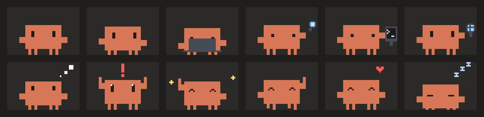
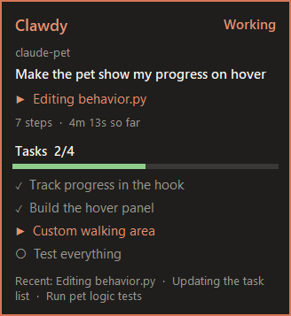

# Clawdy the Desktop Pet

The little square Claude Code character, living on your Windows taskbar. It walks around, does tricks, and reacts to what **Claude Code** is doing in real time. Hover over it to see Claude's progress on your task.

```
 ▐▛███▜▌
▝▜█████▛▘
  ▘▘ ▝▝
```



*Left to right: idle, walking, coding, reading, running a command, browsing, thinking, needs you, celebrating, dancing, happy, sleeping.*

> An unofficial fan project, inspired by the character on Claude Code's welcome screen. Not affiliated with or endorsed by Anthropic.

---

## What it does

- **Always lively:** walks along your taskbar and does little tricks: waves, dances, hops, looks around.
- **Shows what Claude is doing:**
  - types on a laptop while Claude edits code
  - uses a magnifying glass while it reads files
  - taps a terminal while it runs commands
  - spins a globe while it browses
  - shows thought bubbles while it plans
- **Jumps with a "Needs you!" bubble** when Claude is waiting for your approval.
- **Celebrates with "Done!"** when Claude finishes.
- **Hover over it to see progress:** what Claude is doing right now, steps and time, the task list with checkmarks, and the last few actions.
- **Walks where you want:** all of the taskbar or just part of it, e.g. 40% in the middle.
- **Handles several Claude Code sessions at once:** the one that needs you always comes first.
- **Pick it up and drop it** with the mouse; click it for a little love.
- **Stays out of your way:**
  - hides during fullscreen games and videos
  - never steals focus and never shows in Alt+Tab
  - clicks pass through everywhere except the pet itself
- **Starts by itself** when a Claude Code session starts.
- **Customisable:** size, speed, colours, messages, walking area, or a completely custom skin.



---

## How it works

```
 Claude Code                           Clawdy
 ───────────                           ──────
  you ask for something ─┐
  Claude reads, edits,   │  hooks      hooks/pet_hook.py            %USERPROFILE%\.claude-pet\sessions\
  runs commands, updates ├───────────► (runs in the background, ──► <session>.jsonl
  tasks, finishes...     │             never slows Claude down)     one line per event
                         ┘                                                  │
                                                                            ▼
                                        claude_pet.pyw  ◄──── reads new lines 7 times a second
                                        ├─ pet/bridge.py    works out the mood (needs you > working > idle)
                                        │                   and each session's progress
                                        ├─ pet/behavior.py  walking, tricks, jumps, reactions, dragging
                                        ├─ pet/sprites.py   the pixel art, drawn in code
                                        └─ pet/app.py       the see-through window, speech bubbles, hover panel
```

1. **Claude Code hooks** run a small Python script on every relevant event:
   - a request starts
   - a tool is about to run or has finished
   - Claude needs permission
   - a task is created or completed
   - Claude stops, or a session starts or ends

   The hooks are marked `async`, so Claude Code never waits for them.
2. **The hook adds one line** to that session's log file. Several hooks can run at the same moment, and appending lines means none of them overwrite each other.
3. **The pet reads the new lines** about 7 times a second and turns them into:
   - **a mood:** if any session is waiting for you, the pet jumps and shows "Needs you!"; otherwise, if any session is working, it shows that tool's animation (laptop, magnifying glass, terminal, globe, thinking); otherwise it wanders and does tricks.
   - **reactions:** a celebration when Claude finishes, a sweat drop when something fails, a wave when a session starts or ends.
   - **progress for the hover panel:** the request's title, the current action, steps, time, and the task list (from Claude Code's task tools or to-do list).
4. **The window** is a borderless, always-on-top Tk window with a see-through background colour, so only the pet's own pixels catch the mouse. Windows calls keep it from taking focus or appearing in Alt+Tab, keep it sharp on scaled displays, find the taskbar, and spot fullscreen apps. It runs at 60 frames per second.

---

## What you need

- **Windows 10 or 11**
- **[Python 3.8 or newer](https://www.python.org/downloads/)**. No extra packages needed; it only uses Python's standard library, including Tk for the window.
- **Claude Code** (CLI or desktop app). Tested with Claude Code 2.1.270 and Python 3.10.

---

## Step-by-step setup

### 1. Download

Click **Code → Download ZIP** on this page and unzip it somewhere permanent, for example `C:\clawdy`. Or with git:

```bash
git clone https://github.com/parham-SRF05/clawdy-the-desktop-pet.git
```

The hooks point to this folder, so don't move it afterwards; if you do, run step 3 again.

### 2. Install Python

1. Download Python from [python.org](https://www.python.org/downloads/).
2. In the installer, **tick "Add python.exe to PATH"** before clicking Install.
3. Check it worked: open Command Prompt and run `python --version`.

### 3. Connect Clawdy to Claude Code

Open Command Prompt in the project folder (in File Explorer, type `cmd` in the address bar and press Enter) and run:

```bash
python install.py
```

- **What it changes:** it adds Clawdy's hooks to `%USERPROFILE%\.claude\settings.json`, next to any hooks you already have.
- **Safety:** it backs that file up first (`settings.json.bak-claude-pet-<date>`) and is safe to run again.
- **Settings:** it creates Clawdy's settings file at `%USERPROFILE%\.claude-pet\config.json`.

### 4. Start Clawdy

Double-click **`claude_pet.pyw`**. Clawdy appears on your taskbar.

From now on it also **starts by itself** whenever a Claude Code session starts.

### 5. Try it

Give Claude Code a task. Clawdy should:
- think while Claude plans
- type while it edits
- use the terminal while it runs commands
- celebrate when it's done

Hover over Clawdy to see the progress panel.

Claude Code picks up the new hooks straight away. If nothing happens, start a new Claude Code session.

---

## Using it

| Do this | Clawdy does |
|---|---|
| Hover over it | Stops, waves, and shows Claude's progress |
| Click it | Happy hop with hearts |
| Drag it | Dangles; let go and it falls back onto the taskbar |
| Right-click it | Menu: sleep / wake up, walk around, do tricks, speech bubbles, walking area, size, settings, quit |

**The progress panel shows:**

| Part | Meaning |
|---|---|
| Working / Needs you / Done | What that Claude Code session is doing |
| Project and title | The folder Claude is working in, and the first line of your request |
| ▶ Editing app.py | The action happening right now |
| 7 steps · 4m 13s | Tool calls and time since your request |
| Tasks 2/4 and the bar | Claude's task list: ✓ done, ▶ in progress, ○ to do |
| Recent | The last few actions |

---

## Customise it

Right-click Clawdy → **Settings file...** to open `%USERPROFILE%\.claude-pet\config.json`. Restart Clawdy after editing it. Changes made from the right-click menu apply straight away.

| Setting | Default | What it does |
|---|---|---|
| `name` | `"Clawdy"` | Name shown on the progress panel |
| `scale` | `2` | Size: screen pixels per art pixel (1-8) |
| `walk_speed` | `1.0` | Walking speed (0.2-3) |
| `wander` | `true` | Walk around when Claude is idle |
| `walk_width_percent` | `100` | How much of the taskbar it walks on (10-100) |
| `walk_align` | `"center"` | Where that part is: `"left"`, `"center"` or `"right"` |
| `tricks` | `true` | Little tricks while wandering |
| `bubbles` | `true` | Speech bubbles |
| `react_to_claude` | `true` | React to Claude Code at all |
| `start_with_claude_code` | `true` | Start Clawdy when a Claude Code session starts |
| `store_task_titles` | `true` | Show the first line of your request in the progress panel |
| `hide_in_fullscreen` | `true` | Hide while a game or video fills the main screen |
| `sleep_after_seconds` | `0` | Fall asleep after this long with nothing happening (`0` = never) |
| `messages` | | Bubble text for `done`, `needs_you`, `hello`, `bye`, `error`, `compact`, `poke` |
| `colors` | `{}` | Recolour Clawdy |
| `skin` | `""` | Use a custom skin (see below) |

**Walk on 40% of the taskbar, on the left:**

```json
"walk_width_percent": 40,
"walk_align": "left"
```

**A blue Clawdy with a dark outline:**

```json
"colors": {"body": "#6aa3ff", "outline": "#1b2a44"}
```

Colour names: `body`, `eye`, `shine`, `outline` (empty = no outline, like the original), `prop`, `prop_light`, `yellow`, `red`, `snooze`, `bubble`.

### Custom skins

Draw your own pet, for example in [Piskel](https://www.piskelapp.com/) (free) or Aseprite, and export a sprite sheet.

1. Create a folder `%USERPROFILE%\.claude-pet\skins\my-pet\`.
2. Save your sprite sheet there as `sheet.png`: a transparent background and hard pixel edges (no soft, semi-transparent edges).
3. Add `skin.json` saying where each animation is on the sheet:

   ```json
   {
     "frame_width": 48,
     "frame_height": 32,
     "animations": {
       "idle":      {"row": 0, "frames": 4, "fps": 4},
       "walk":      {"row": 1, "frames": 4, "fps": 10},
       "celebrate": {"row": 2, "frames": 6, "fps": 10}
     }
   }
   ```

4. Set `"skin": "my-pet"` in `config.json` and restart Clawdy.

With 48×32 frames (the built-in size, the character standing on the bottom row), any animation your skin leaves out keeps the built-in art. Other frame sizes must include every animation.

| Animation | Plays when |
|---|---|
| `idle`, `walk`, `sit`, `look`, `dance`, `sleep` | Normal life and tricks |
| `think` | Claude is planning |
| `type` | Editing files |
| `read` | Reading or searching files |
| `command` | Running commands |
| `web` | Browsing or using MCP tools |
| `alert` | Claude needs you |
| `celebrate` | Claude finished |
| `error` | Something failed |
| `wave`, `happy` | Hello / goodbye, being clicked |
| `drag`, `fall`, `land` | Being picked up and dropped |

---

## Privacy

Everything stays on your PC, in `%USERPROFILE%\.claude-pet\`.

**For each event, the hook keeps:**
- the event and tool name
- a short description of the action, like "Editing app.py" or a command's own description
- task list titles and statuses
- the project folder name
- the first line of your request, used as the panel title. Turn this off with `"store_task_titles": false`.

**It never stores:** code, file contents, command output, or the rest of your messages.

Session logs older than a day are deleted when Clawdy starts.

---

## Troubleshooting

| Problem | What to do |
|---|---|
| Clawdy doesn't react to Claude | Run `python install.py` again and start a new Claude Code session. While Claude works, files should appear in `%USERPROFILE%\.claude-pet\sessions\`. |
| Nothing happens when starting it | Look at `%USERPROFILE%\.claude-pet\pet.log`. Only one Clawdy runs at a time, so check it isn't already walking somewhere. |
| `python` is not recognised | Reinstall Python with **"Add python.exe to PATH"** ticked. |
| It shows up over a game | That game runs in a window rather than true fullscreen. Right-click Clawdy → **Go to sleep**, or quit it. |
| The panel is empty | It shows sessions active in the last hour. Give Claude a task, then hover again. |

**Uninstall:**
1. Remove the hooks by running the command below. Your other hooks are left untouched.
2. Delete the project folder and `%USERPROFILE%\.claude-pet\`.

```bash
python install.py --uninstall
```

---

## Files

| File | What it does |
|---|---|
| `claude_pet.pyw` | Starts Clawdy (double-click; no console window) |
| `install.py` | Adds or removes the Claude Code hooks |
| `hooks/pet_hook.py` | The hook: records each Claude Code event |
| `pet/app.py` | The window: drawing, mouse, speech bubbles, progress panel, menu |
| `pet/behavior.py` | Walking, tricks, jumps, dragging, reactions |
| `pet/bridge.py` | Reads the session logs: mood and progress |
| `pet/sprites.py` | The pixel art and animations, drawn in code |
| `pet/skins.py` | Loads custom sprite-sheet skins |
| `pet/config.py` | Settings and their defaults |
| `pet/winapi.py` | Windows calls: taskbar position, fullscreen detection, focus-free window |
| `tests/` | Tests (no game or Claude Code needed) |

## Tests

```bash
python tests/test_logic.py
```

```bash
python tests/test_install.py
```

- **`test_logic.py`:**
  - the hook: what it records and what it never records
  - session priority, reactions and progress tracking
  - walking, tricks, the walking area, hover, dragging, and never sleeping by default
  - settings validation
  - the character's exact shape
- **`test_install.py`:** installing adds each hook once, keeps your other hooks, and uninstalling restores your settings exactly.

## Notes

- **Windows only.** It walks on the main screen's taskbar.
- **Automatic start:** from Claude Code's `SessionStart` hook. Turn it off with `"start_with_claude_code": false`.
